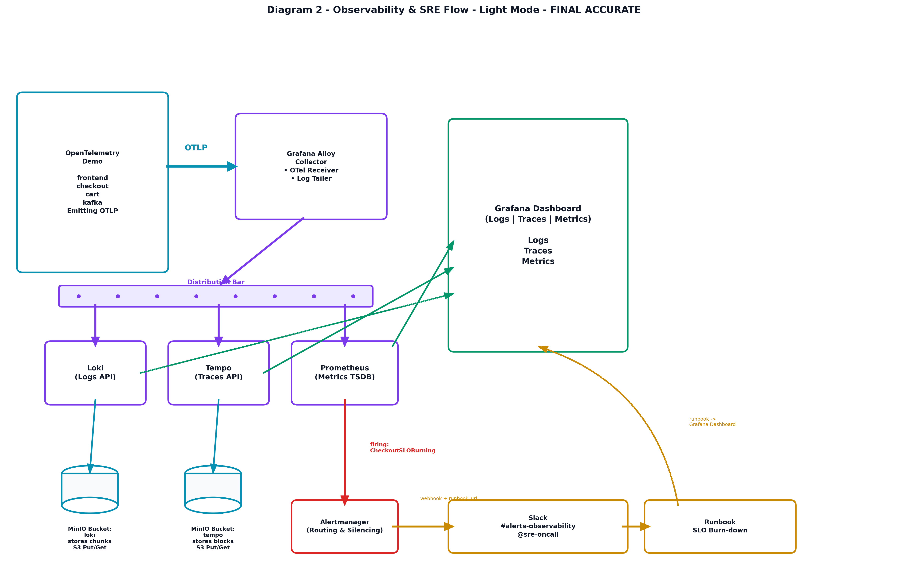
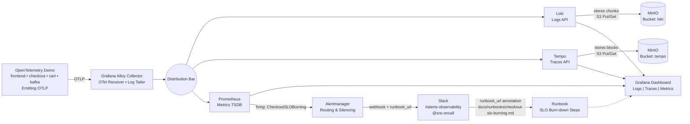

# k3d-observability-lab

A production-grade, local GitOps observability lab running on **K3d (Kubernetes in Docker)**, orchestrated declaratively via **Terraform** and continuously synced using **Argo CD (App-of-Apps pattern)**.

---
## Architecture

### Diagram 1 - GitOps Workflow (with Production Hardening)

<picture>
  <source media="(prefers-color-scheme: dark)" srcset="./docs/images/diagram1_darl.png">
  <source media="(prefers-color-scheme: light)" srcset="./docs/images/diagram1_light.png">
  
</picture>

**Flow:** GitHub (main) → Terraform (bootstrap/main.tf provisions k3d + Argo CD) → K3d Cluster → Argo CD Root App (App-of-Apps) 
→ Horizontal distribution bar → 8 apps in single row: otel-demo (11 microservices) • prometheus • dashboards • alloy • loki • tempo • minio • hardening-app.yaml (PDBs + Resource Limits + Kyverno policies)

Production Mapping → AWS EKS (Managed K8s Multi-AZ • S3 • CloudWatch • IAM • VPC) below row.

---

### Diagram 2 - Observability & SRE Flow (Validated + Slack + Runbook)

<picture>
  <source media="(prefers-color-scheme: dark)" srcset="./docs/images/diagram2_dark.png">
  <source media="(prefers-color-scheme: light)" srcset="./docs/images/diagram2_light.png">
  
</picture>

**Flow:**

---

### Architecture Overview

This repository demonstrates enterprise cloud-native patterns for local development, testing infrastructure automation, and validating full-stack observability pipelines before pushing to cloud environments (AWS EKS).

```text
k3d-observability-lab/
├── .github/
│   └── workflows/
│       └── ci.yaml                     # GitHub Actions CI/CD pipeline
├── clusters/
│   └── observability-cluster.yaml      # K3d multi-node cluster definition
├── bootstrap/                        
│   ├── main.tf                       # Terraform automated cluster & Argo CD provisioner
│   └── argocd-install.yaml           # Upstream Argo CD installation manifests
├── argocd/                           
│   └── root-app.yaml                 # Argo CD App-of-Apps root application manifest
└── apps/                             
    └── monitoring/                   # Helm values, ingress routes, and configurations
        ├── minio-values.yaml
        ├── loki-values.yaml
        ├── tempo-values.yaml
        ├── alloy-values.yaml
        ├── minio-sealed-secret.yaml          # Encrypted MinIO credentials for GitOps
        ├── sealed-alertmanager-slack.yaml    # Encrypted Slack webhook secret for alerts
        └── ingress.yaml                      # Traefik local routing rules (*.local)

```

This project implements a fully automated observability stack mimicking enterprise cloud-native environments:

* **Log Aggregation:** Grafana Loki (Single-Binary mode) backed by MinIO object storage.
* **Distributed Tracing:** Grafana Tempo integrated with OTLP backends.
* **Telemetry Collection:** Grafana Alloy acting as a high-performance OpenTelemetry collector.
* **Metrics & Storage:** Prometheus metrics collection, custom alerting, and MinIO S3-compatible object storage.
* **GitOps Continuous Deployment:** Argo CD continuously synchronizing cluster state from this repository.
* **CI Validation:** GitHub Actions validating syntax, linting, and security policies on every push.

---

### Technology Stack

* **Orchestration:** Kubernetes via **K3d** (1 Server, 2 Agents, custom load balancer port mappings for HTTP/HTTPS entrypoints).
* **Infrastructure as Code (IaC):** **Terraform** (`null_resource`, `helm`, and `kubectl` providers).
* **Continuous Delivery (CD):** **Argo CD** utilizing the **App-of-Apps** pattern.
* **Observability & Routing Components:**
* **Prometheus:** Metrics collection, storage, and alerting rule evaluation.
* **MinIO:** S3-compatible object storage backend.
* **Grafana Loki:** Log aggregation and storage.
* **Grafana Tempo:** Distributed tracing backend.
* **Grafana Alloy:** OpenTelemetry collector and telemetry agent.
* **Traefik Ingress:** Local host-based routing (`*.local`).


---

### Local Ingress Routing (`*.local`)

Instead of relying solely on `kubectl port-forward`, this lab configures Traefik ingress routes mapped via local host domains. To access services directly in your browser, ensure your local `/etc/hosts` (or `C:\Windows\System32\drivers\etc\hosts` on Windows) includes the following mappings pointing to your k3d load balancer IP (`127.0.0.1`):

```text
127.0.0.1 grafana.local
127.0.0.1 prometheus.local
127.0.0.1 minio-console.local
127.0.0.1 loki.local
127.0.0.1 tempo.local
127.0.0.1 shop.local
127.0.0.1 argocd.local

```

---

### Quick Start Guide

#### Prerequisites

Ensure you have the following installed on your development environment:

* [Docker Desktop](https://www.docker.com/) (running)
* [K3d](https://k3d.io/)
* [Terraform](https://www.terraform.io/)
* [Helm](https://helm.sh/)
* [Kubectl](https://kubernetes.io/docs/tasks/tools/)
* [Argo CD CLI](https://www.google.com/search?q=https://argo-cd.readthedocs.io/en/stable/cli_usage/)
* **kubeseal** (CLI tool for Bitnami Sealed Secrets encryption)
* *Note for Windows users:* If installing via Chocolatey, use `choco install sealed-secrets` (the package name is `sealed-secrets`, not `kubeseal`).


---

#### 1. Bootstrap the Environment via Terraform

Navigate to the `bootstrap/` directory and execute Terraform to spin up the local K3d cluster, deploy Argo CD via Helm, and apply the Root GitOps application:

```bash
cd bootstrap
terraform init
terraform apply

```

---

#### 2. Secrets Management (Sealed Secrets Workflow)

To handle component dependencies securely in a true GitOps workflow (ensuring MinIO and its credentials exist before backends like Loki and Tempo deploy), we use Bitnami's **Sealed Secrets** combined with native Argo CD **Sync Waves (`sync-wave`)**.

Instead of saving plaintext credentials directly in Git, we generate standard secrets locally and seal them into custom `SealedSecret` resources that are safe to commit.

##### Step A: Create and Encrypt the MinIO Secret Locally

1. Create a standard plaintext secret manifest locally (`minio-secret.yaml`) and ensure it is added to your `.gitignore` so it is **never committed** to GitHub:
```yaml
apiVersion: v1
kind: Secret
metadata:
  name: minio-credentials
  namespace: monitoring
type: Opaque
stringData:
  rootUser: "admin"
  rootPassword: "your-super-secret-password"

```


2. Encrypt the secret using `kubeseal` (this communicates directly with the running K3d cluster to fetch the cluster's public encryption key):
```bash
kubeseal --format=yaml -f minio-secret.yaml -w apps/monitoring/minio-sealed-secret.yaml --controller-name sealed-secrets --controller-namespace kube-system

```


##### Step B: Create and Encrypt the Slack Webhook Secret Locally

1. Similarly, create a plaintext secret for Slack alerting integration (`alertmanager-slack.yaml`) locally and add it to `.gitignore`:
```yaml
apiVersion: v1
kind: Secret
metadata:
  name: alertmanager-slack
  namespace: monitoring
type: Opaque
stringData:
  api-url: "https://hooks.slack.com/services/YOUR/SLACK/WEBHOOK"

```


2. Seal the Slack secret:
```bash
kubeseal --format=yaml -f alertmanager-slack.yaml -w apps/monitoring/sealed-alertmanager-slack.yaml --controller-name sealed-secrets --controller-namespace kube-system

```


When Argo CD syncs these sealed resources to the cluster, the in-cluster `sealed-secrets` controller safely decrypts them back into standard Kubernetes secrets automatically.

---

#### 3. Access the Services via Ingress

Once your hosts file is updated and services are running, you can access your stack directly via browser:

* **Grafana Dashboard:** `[http://grafana.local](http://grafana.local)`
* **Prometheus UI:** `[http://prometheus.local](http://prometheus.local)`
* **Argo CD UI:** `[http://argocd.local](http://argocd.local)` *(Default Username: `admin`, Password: `test1234` or check your Terraform outputs)*
* **MinIO Console:** `[http://minio-console.local](http://minio-console.local)`
* **OTel Demo Shop:** `[http://shop.local](http://shop.local)`

---

### GitOps Workflow

1. Modify any application Helm values file, sealed secret, or ingress route under `apps/monitoring/`.
2. Commit and push your changes to your remote GitHub repository (`main` branch).
3. Argo CD automatically detects drift via its automated sync policy (`prune: true`, `selfHeal: true`) and rolls out updates live into your local K3d cluster.