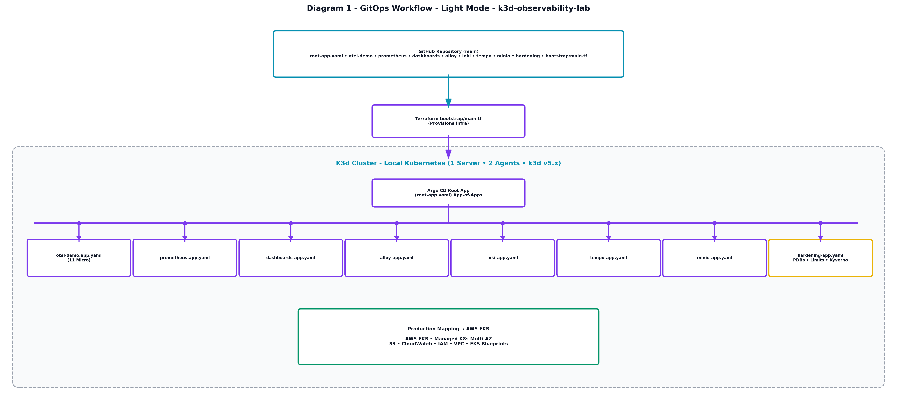
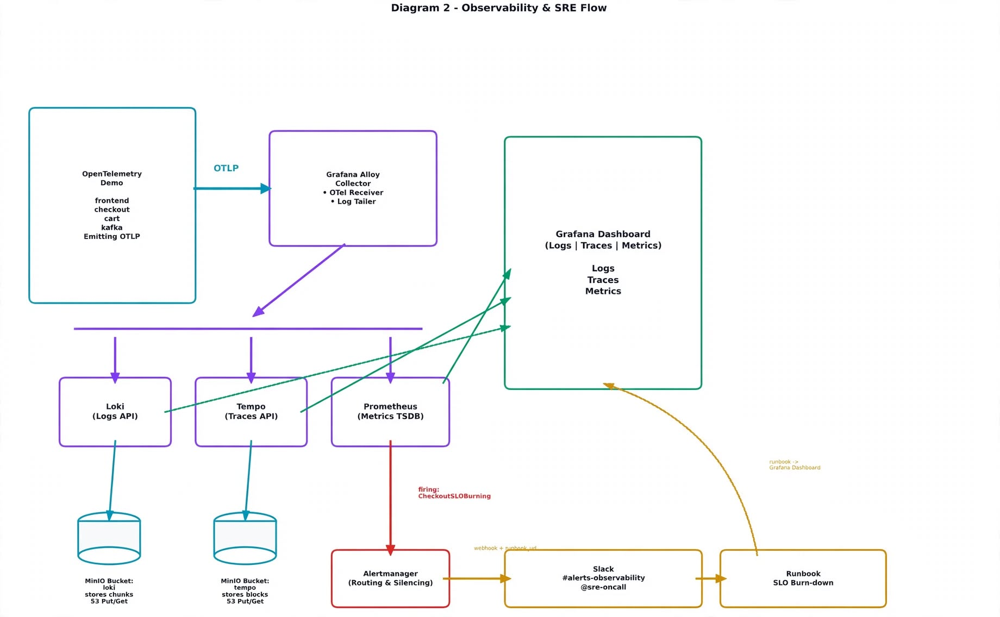
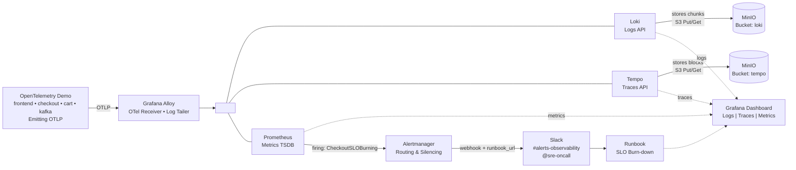

# k3d-observability-lab


A production-oriented, local GitOps observability lab running on **K3d (Kubernetes in Docker)**, orchestrated declaratively via **Terraform** and continuously synced using **Argo CD (App-of-Apps pattern)**.

Local Kubernetes (K3d) cluster provisioned with Terraform, running **OpenTelemetry Demo** as the SUT, with full **LGTM stack (Loki, Grafana, Tempo, Prometheus)** + **Grafana Alloy**, all deployed via **Argo CD App-of-Apps**. Built to practice SRE, not just monitoring.

---

### Why this project?

Most observability demos show metrics. This lab shows **how SREs work**:

* **End-to-End Telemetry:** App emits OTel traces/metrics/logs → Alloy collects → Loki/Tempo/Prometheus store → Grafana visualizes → Prometheus alerts → Runbook tells you what to do → PDBs/ResourceLimits keep it alive.
* **GitOps Automation:** Ensures everything is declarative, drift-corrected, and fully reproducible.
* **Designed for AWS EKS migration in mind:** the GitOps, Terraform, Helm, observability, and SRE patterns are intentionally structured so they can be adapted to managed Kubernetes environments such as Amazon EKS.

---

## Architecture

### Diagram 1 - GitOps Workflow (with Production Hardening)

<picture>
  <source media="(prefers-color-scheme: dark)" srcset="./docs/images/diagram1_dark.png">
  <source media="(prefers-color-scheme: light)" srcset="./docs/images/diagram1_light.png">
  
</picture>

**Flow:** GitHub (`main`) → Terraform (`bootstrap/main.tf` provisions k3d + Argo CD) → K3d Cluster → Argo CD Root App (App-of-Apps) → 8 core child apps: `otel-demo` (11 microservices) • `prometheus` • `dashboards` • `alloy` • `loki` • `tempo` • `minio` • `hardening` (PDBs + Resource Limits + Kyverno policies).

---

### Diagram 2 - Observability & SRE Flow

<picture>
  <source media="(prefers-color-scheme: dark)" srcset="./docs/images/diagram2_dark.png">
  <source media="(prefers-color-scheme: light)" srcset="./docs/images/diagram2_light_new.png">
  
</picture>



---

### Repository Structure

```text
k3d-observability-lab/
├── .github/
│   └── workflows/
│       └── ci.yaml                     # GitHub Actions CI pipeline
├── clusters/
│   └── observability-cluster.yaml      # K3d multi-node cluster definition
├── bootstrap/                        
│   ├── main.tf                       # Terraform automated cluster & Argo CD provisioner
│   └── argocd-install.yaml           # Upstream Argo CD installation manifests
├── argocd/                           
│   └── root-app.yaml                 # Argo CD App-of-Apps root application manifest
└── apps/                             
    └── monitoring/                   # Helm values, ingress routes, and configurations
        ├── minio-values.yaml
        ├── loki-values.yaml
        ├── tempo-values.yaml
        ├── alloy-values.yaml
        ├── minio-sealed-secret.yaml          # Encrypted MinIO credentials for GitOps
        ├── sealed-alertmanager-slack.yaml    # Encrypted Slack webhook secret for alerts
        └── ingress.yaml                      # Traefik local routing rules (*.local)

```

---

### What I Built (SRE Focus)

#### 1. GitOps with App-of-Apps

* `argocd/root-app.yaml` points to `apps/monitoring/` and discovers child apps automatically.
* No manual `helm upgrade`. A push to `main` triggers an automatic sync in ~30 seconds.
* Resolved real-world Argo CD challenges like `SharedResourceWarning` conflicts by cleanly scoping resource ownership (e.g., PDBs owned exclusively by the hardening app).

#### 2. Full Observability Pipeline (LGTM)

* **Traces:** OTel Demo → Alloy (OTLP receiver) → Tempo → Grafana Explore.
* **Logs:** Pods → Alloy (`loki.source.kubernetes`) → Loki (backed by MinIO) → Grafana.
* **Metrics:** Kubelet/cAdvisor + ServiceMonitors → Prometheus → Grafana dashboards.
* **Correlated:** Exemplars linking metrics directly to traces.

#### 3. SRE Production Hardening

Located in `apps/platform/hardening/`:

* **Resource Limits:** Enforced CPU/Memory requests and limits.
* **PodDisruptionBudgets (PDBs):** Configured `minAvailable: 1` for critical components (`cart`, `checkout`, `frontend`, `kafka`) to safely handle voluntary cluster disruptions.
* **Probes:** Validated liveness and readiness probes (`/health`) across the OpenTelemetry demo microservices.
* **Runbooks:** Documented incident responses (`docs/runbooks/checkout-slo-burning.md`) for structured failure recovery.

#### 4. Alerting & Incident Response

* Custom PromQL alerts tracking checkout error budgets and burn rates.
* Alertmanager webhook integration routed to Slack with active `runbook_url` annotations.

---

### Technology Stack

* **Orchestration:** Kubernetes via **K3d** (1 Server, 2 Agents, custom load balancer port mappings for HTTP/HTTPS entrypoints).
* **Infrastructure as Code (IaC):** **Terraform** (`null_resource`, `helm`, and `kubectl` providers).
* **Continuous Delivery (CD):** **Argo CD** utilizing the **App-of-Apps** pattern.
* **Observability & Routing Components:**
* **Prometheus:** Metrics collection, storage, and alerting rule evaluation.
* **MinIO:** S3-compatible object storage backend.
* **Grafana Loki:** Log aggregation and storage.
* **Grafana Tempo:** Distributed tracing backend.
* **Grafana Alloy:** OpenTelemetry collector and telemetry agent.
* **Traefik Ingress:** Local host-based routing (`*.local`).


---

### Local Ingress Routing (`*.local`)

Instead of relying solely on `kubectl port-forward`, this lab configures Traefik ingress routes mapped via local host domains. To access services directly in your browser, update your local `/etc/hosts` file (`C:\Windows\System32\drivers\etc\hosts` on Windows) with the following mappings pointing to `127.0.0.1`:

```text
127.0.0.1 grafana.local
127.0.0.1 prometheus.local
127.0.0.1 minio-console.local
127.0.0.1 loki.local
127.0.0.1 tempo.local
127.0.0.1 shop.local
127.0.0.1 argocd.local

```

---

### Quick Start Guide

#### Prerequisites

Ensure you have the following installed on your development environment:

* [Docker Desktop](https://www.docker.com/) (running)
* [K3d](https://k3d.io/)
* [Terraform](https://www.terraform.io/)
* [Helm](https://helm.sh/)
* [Kubectl](https://kubernetes.io/docs/tasks/tools/)
* [Argo CD CLI](https://www.google.com/search?q=https://argo-cd.readthedocs.io/en/stable/cli_usage/)
* **kubeseal** (CLI tool for Bitnami Sealed Secrets encryption)
* *Note for Windows users:* Install via Chocolatey using `choco install sealed-secrets` (the package name is `sealed-secrets`, not `kubeseal`).


---

#### 1. Bootstrap the Environment via Terraform

Navigate to the `bootstrap/` directory and execute Terraform to spin up the local K3d cluster, deploy Argo CD via Helm, and apply the Root GitOps application:

```bash
cd bootstrap
terraform init
terraform apply

```

---

#### 2. Secrets Management (Sealed Secrets Workflow)

To handle component dependencies securely in a true GitOps workflow (ensuring MinIO and its credentials exist before backends like Loki and Tempo deploy), we use Bitnami's **Sealed Secrets** combined with native Argo CD **Sync Waves (`sync-wave`)**.

##### Step A: Create and Encrypt the MinIO Secret Locally

1. Create a standard plaintext secret manifest locally (`minio-secret.yaml`) and ensure it is added to your `.gitignore` so it is **never committed** to GitHub:
```yaml
apiVersion: v1
kind: Secret
metadata:
  name: minio-credentials
  namespace: monitoring
type: Opaque
stringData:
  rootUser: "admin"
  rootPassword: "your-super-secret-password"

```


2. Encrypt the secret using `kubeseal` (communicates directly with the running K3d cluster to fetch the public key):
```bash
kubeseal --format=yaml -f minio-secret.yaml -w apps/monitoring/minio-sealed-secret.yaml --controller-name sealed-secrets --controller-namespace kube-system

```


##### Step B: Create and Encrypt the Slack Webhook Secret Locally

1. Create a plaintext secret for Slack alerting integration (`alertmanager-slack.yaml`) locally and add it to `.gitignore`:
```yaml
apiVersion: v1
kind: Secret
metadata:
  name: alertmanager-slack
  namespace: monitoring
type: Opaque
stringData:
  api-url: "https://hooks.slack.com/services/YOUR/SLACK/WEBHOOK"

```


2. Seal the Slack secret:
```bash
kubeseal --format=yaml -f alertmanager-slack.yaml -w apps/monitoring/sealed-alertmanager-slack.yaml --controller-name sealed-secrets --controller-namespace kube-system

```


When Argo CD syncs these sealed resources, the in-cluster `sealed-secrets` controller automatically decrypts them into standard Kubernetes secrets.

---

#### 3. Access the Services via Ingress

Once your hosts file is updated and services are running, access your stack directly in your browser:

* **Grafana Dashboard:** `[http://grafana.local](http://grafana.local)`
* **Prometheus UI:** `[http://prometheus.local](http://prometheus.local)`
* **Argo CD UI:** `[http://argocd.local](http://argocd.local)` *(Argo CD UI: http://argocd.local — credentials are configured during bootstrap; see Terraform configuration/output instructions.)*
* **MinIO Console:** `[http://minio-console.local](http://minio-console.local)`
* **OTel Demo Shop:** `[http://shop.local](http://shop.local)`

---

### GitOps Workflow

1. Modify any application Helm values file, sealed secret, or ingress route under `apps/monitoring/`.
2. Commit and push your changes to your remote GitHub repository (`main` branch).
3. Argo CD automatically detects drift via its automated sync policy (`prune: true`, `selfHeal: true`) and rolls out updates live into your local K3d cluster.

---

## 🧪 SRE Failure Scenarios & Exercises

Practice production incidents hands-on - each maps to your LGTM stack.

| Scenario | Incident Pattern | What You Practice |
|----------|------------------|------------------|
| [Scenario 1 - Checkout SLO Burn](./docs/failure-scenarios.md#scenario-1--checkout-error-rate-increases-slo-burn) | SLO burn, alert firing | Metrics → Traces → Logs correlation |
| [Scenario 2 - Pod Unhealthy](./docs/failure-scenarios.md#scenario-2--pod-becomes-unhealthy-readiness-probe-failure) | Readiness probe failure | Endpoint removal, diagnosis |
| [Scenario 3 - Node Disruption](./docs/failure-scenarios.md#scenario-3--node-disruption-pdb-protects-critical-workloads) | Voluntary disruption | PDB `minAvailable: 1` protection |
| [Scenario 4 - GitOps Drift](./docs/failure-scenarios.md#scenario-4--gitops-drift-manual-change--self-heal) | Manual drift | Argo CD self-heal |
| [Scenario 5 - Git Deployment](./docs/failure-scenarios.md#scenario-5--configuration-deployment-git--ci--argo) | Config promotion | Git → CI → Argo flow |
| [Scenario 6 - Secret Rotation](./docs/failure-scenarios.md#scenario-6--secret-rotation-your-actual-bug) | Secret rotation | SealedSecrets |
| [Scenario 7 - Resource Exhaustion](./docs/failure-scenarios.md#scenario-7--resource-exhaustion-limit-enforcement) | Noisy neighbor | Limits + OOMKilled |

> **Full guide:** [docs/failure-scenarios.md](./docs/failure-scenarios.md) - 7 exercises with commands, expected artifacts, SRE lessons.

**Quick start:**
```bash
# Scenario 1 - trigger SLO burn
kubectl -n otel-demo set env deployment/cart OTEL_DEMO_CART_FAILURE_RATE=0.3
# Watch Grafana grafana.local → Checkout dashboard → Tempo trace → Loki logs → Slack alert

# Scenario 3 - test PDB
kubectl cordon k3d-observability-lab-agent-0
kubectl drain k3d-observability-lab-agent-0 --ignore-daemonsets --delete-emptydir-data
# Should block when only 1 cart left due to PDB
kubectl uncordon k3d-observability-lab-agent-0
```
---

### For Recruiters / Interviewers

This is not just a standard Helm install demo. It is a comprehensive **GitOps + SRE lab** demonstrating:

* Building local environments that accurately mirror production EKS patterns.
* Debugging and handling real-world Argo CD synchronization edge cases.
* Bridging full-stack observability (logs, metrics, and traces) directly to actionable SLOs and runbooks.
* Enterprise readiness via production thinking (PDBs, resource constraints, and secure secret management).